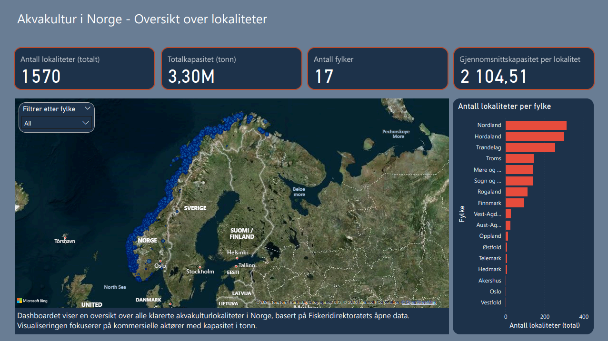
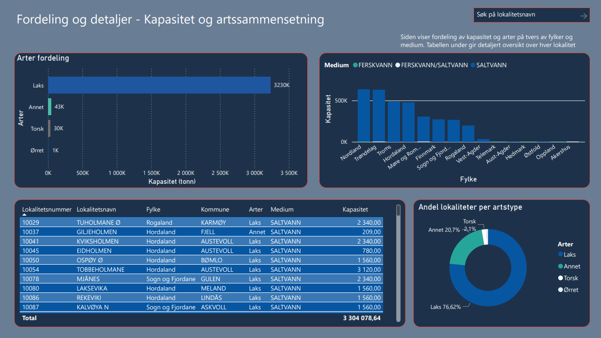
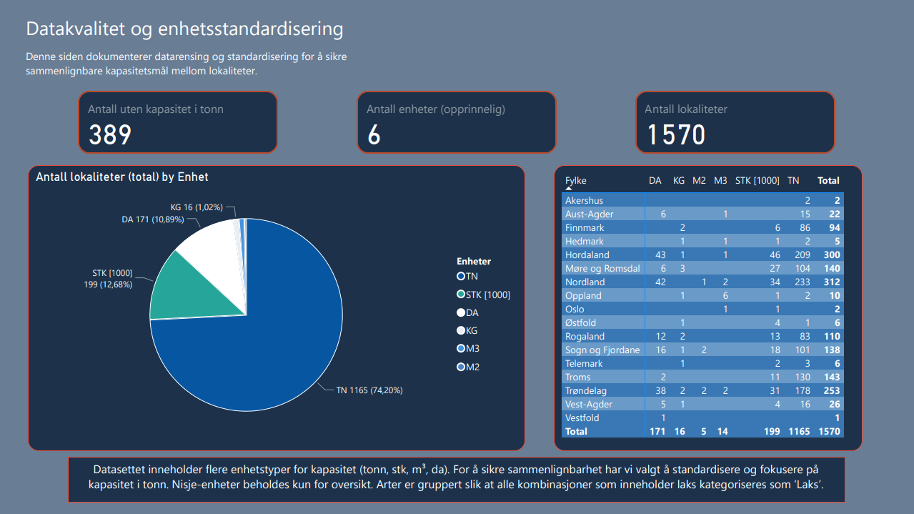
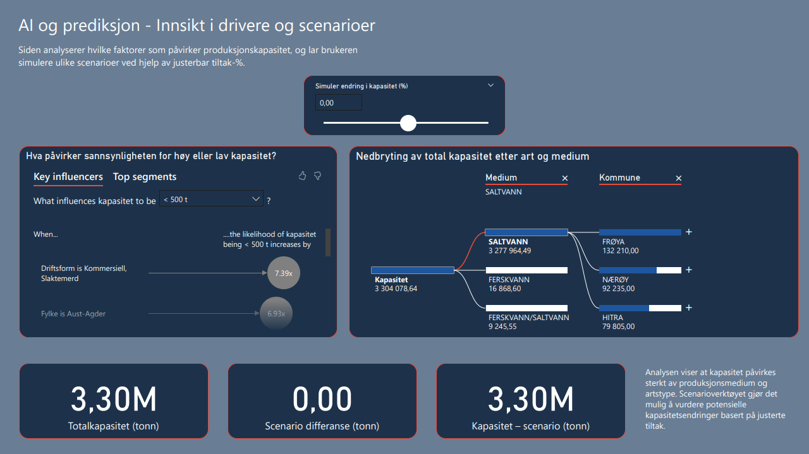

# 🐟 Aquaculture Dashboard – Power BI Project

## 📘 Overview
This Power BI dashboard analyzes Norwegian aquaculture facilities based on open data from the Directorate of Fisheries.  
The project focuses on production capacity, commercial operations, and geographic distribution across regions.

## 🎯 Goals
- Clean and standardize the dataset (unit conversion, filtering commercial operations)
- Visualize total production capacity by region and species
- Identify key factors influencing capacity
- Simulate capacity changes using AI and what-if analysis

## 📊 Pages
1. **Oversikt:** Total production capacity, commercial sites, and map of locations  
2. **Fordeling og detaljer:** Breakdown by species and production medium  
3. **Datakvalitet:** Data cleaning summary and unit standardization  
4. **AI og prediksjon:** Key influencers and scenario simulation  

## 🧠 Tools and Skills
- Power BI (DAX, Power Query, Key Influencers, What-If)
- Data cleaning and transformation
- Business Intelligence design and storytelling
- Geographical visualization

## 📷 Preview

## 📁 Files
- `PowerBI_Akvakulturer_lokaliteter.pbix` – Main Power BI file  
- `data_sample.csv` – Example dataset  
- `dashboard_preview.png` – Dashboard screenshot  

## 👤 Author
Developed by Runar Olsen  
Built to demonstrate analytical and visualization skills for BI roles.